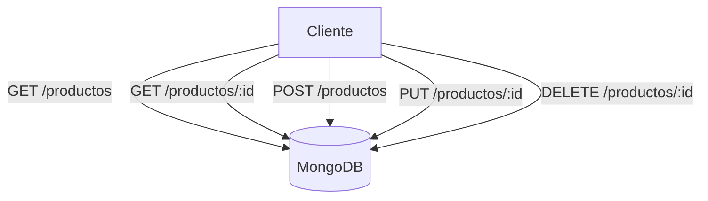

# API Supermercado

## Resumen

API REST para manejar productos de un supermercado. Permite crear, leer, actualizar y eliminar productos en la base de datos MongoDB.Incluye un frontend sencillo para interactuar con la API.

---

## Endpoints

### GET /productos  
Obtiene todos los productos.

Ejemplo con curl:  
```bash
curl http://localhost:3000/productos
```

---

### GET /productos/:id  
Obtiene un producto por su ID.

Ejemplo:  
```bash
curl http://localhost:3000/productos/642f1c5c8a1234567890abcd
```

---

### POST /productos  
Crea un nuevo producto.

Ejemplo:  
```bash
curl -X POST http://localhost:3000/productos \
  -H "Content-Type: application/json" \
  -d '{"codigo": 1010, "nombre": "Queso", "precio": 3.99, "categoria": "Lácteos"}'
```

---

### PUT /productos/:id  
Actualiza un producto por ID.

Ejemplo:  
```bash
curl -X PUT http://localhost:3000/productos/642f1c5c8a1234567890abcd \
  -H "Content-Type: application/json" \
  -d '{"precio": 4.50}'
```

---

### DELETE /productos/:id  
Elimina un producto por ID.

Ejemplo:  
```bash
curl -X DELETE http://localhost:3000/productos/642f1c5c8a1234567890abcd
```

---

## Manejo de errores

- Si el producto no existe, la API responde con código `404` y un mensaje de error.
- Para errores del servidor, se devuelve código `500`.
- Para datos inválidos, se devuelve código `400`.

---

## Diagrama de flujo


